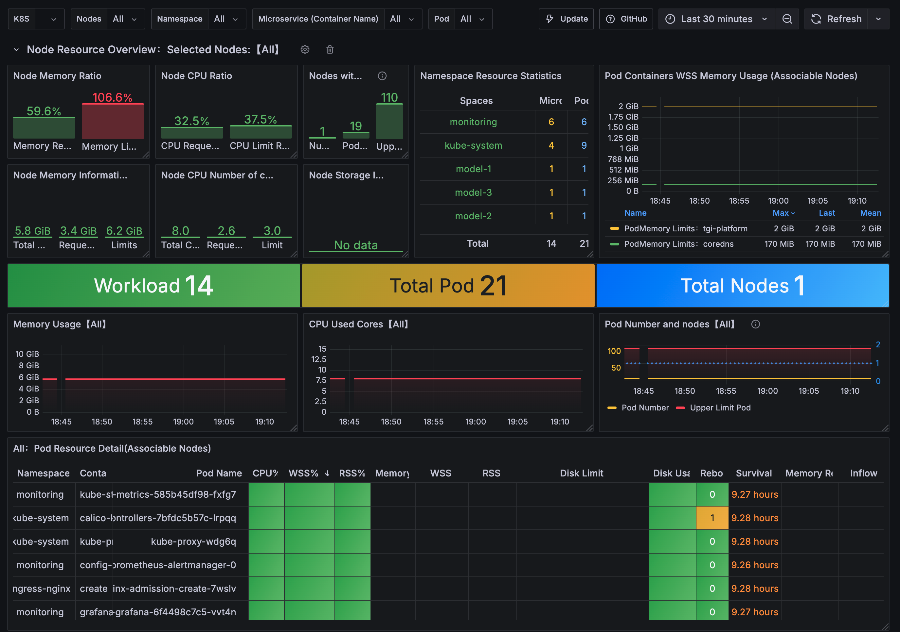

# InferenceHub

InferenceHub is a platform designed to:  
- Deploy multiple text generation models as independent services.  
- Isolate each model in its own Kubernetes namespace for security and resource management.  
- Provide a unified monitoring stack (Prometheus + Grafana) to track health, usage, and performance.  
- Make deployments repeatable and configurable using Helm charts and values files.

## Project Structure & Flow

### `model-inference/`  
Contains the FastAPI app (`main.py`) that serves text generation models using HuggingFace Transformers.  
- The app exposes endpoints for generating text, health checks, and retrieving chat logs.  
- Metrics are exported for Prometheus scraping.

### `helm/tgi-platform/`  
Helm chart for deploying the inference service as a scalable, configurable Kubernetes workload.  
- Supports persistent storage for model cache and chat logs.  
- Ingress, service, probes, and resource settings are customizable per tenant.
- Network Policies: Enforced strict traffic isolation for each tenant.

### `values/tenants/`  
Tenant-specific Helm values files (e.g., `model-1.yaml`, `model-2.yaml`).  
- Define which model to serve, resource limits, ingress hostnames, and storage settings for each tenant.

### `infrastructure/`  
Kubernetes manifests for namespaces and storage classes.  
- Ensures each tenant and monitoring stack runs in its own namespace.

### `helm/monitoring/`  
Helm chart values for deploying the Prometheus and Grafana monitoring stack.  
- Configures service and ingress for monitoring tools.

### `scripts/`  
- `setup-cluster.sh`: Sets up namespaces, storage classes, and the NGINX ingress controller.  
- `deploy-monitoring.sh`: Deploys the monitoring stack with a specified Grafana admin password.  
- `deploy-tenant.sh`: Deploys a tenant's inference service using its values file.

## CI/CD

GitHub Actions workflow (`.github/workflows/deploy-docker.yaml`) builds and pushes the inference Docker image to Docker Hub on changes.

## Grafana Dashboard

