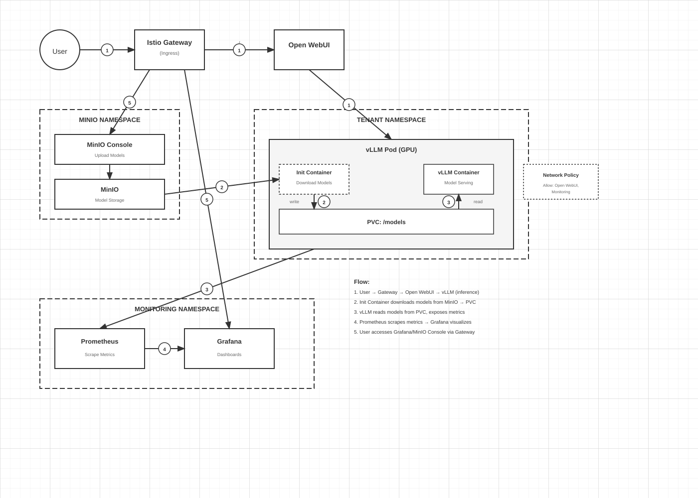
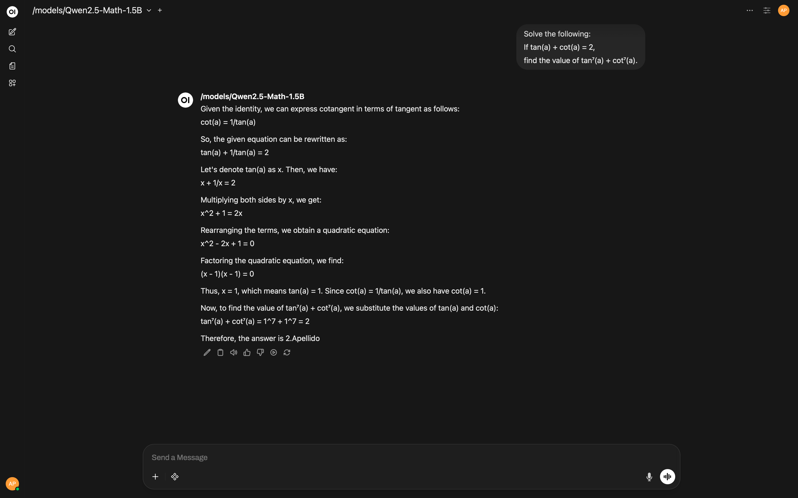
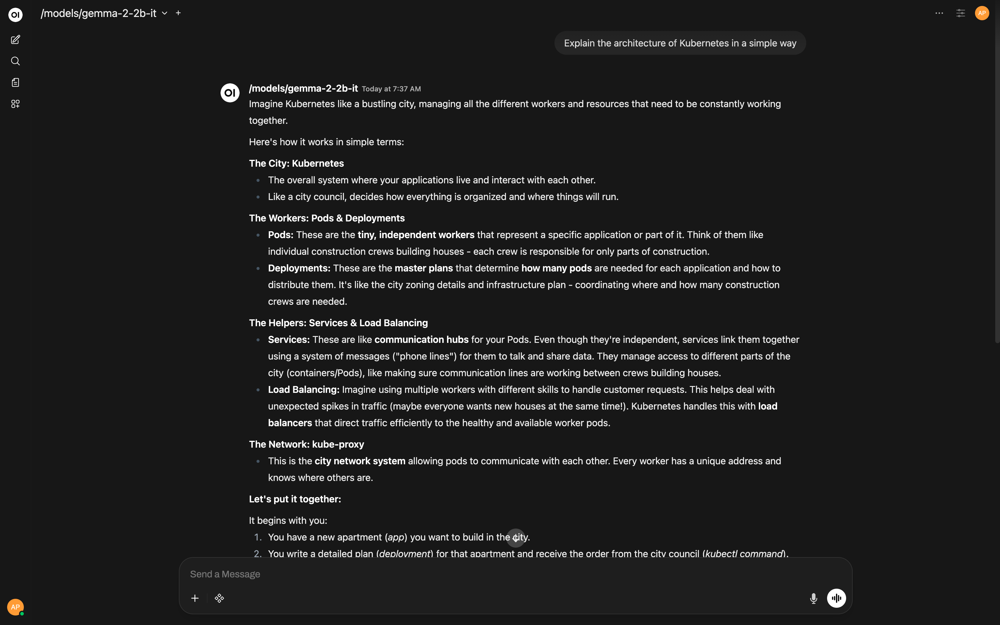
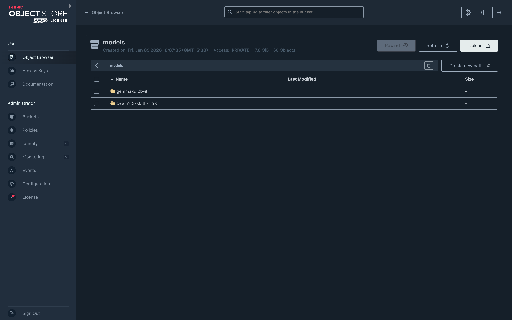
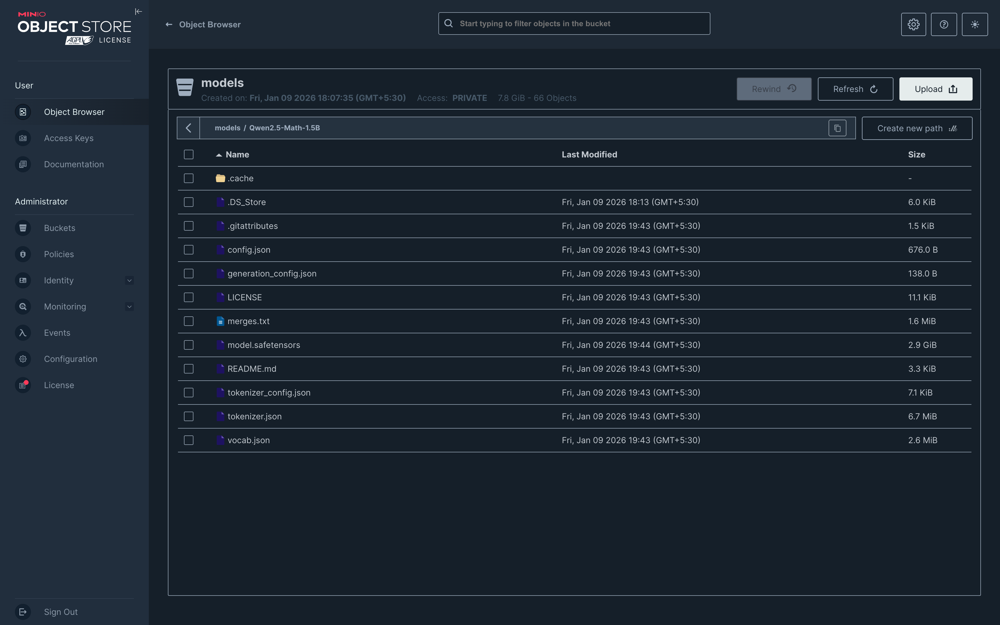
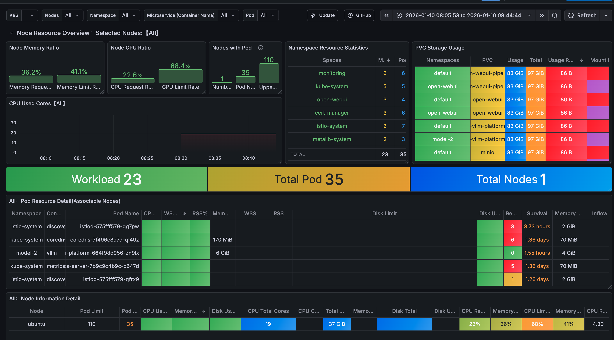
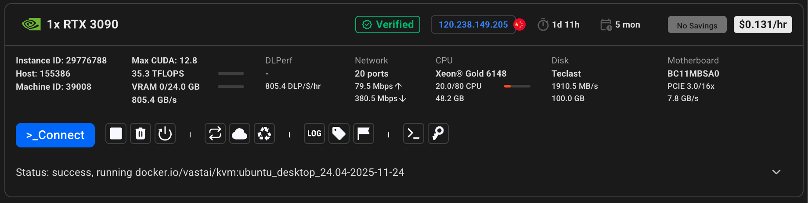

# Tenant Based Deployment with vLLM

A Kubernetes-based **LLM inference deployment** with GPU support, model management, and monitoring using vLLM, Istio, MinIO, Prometheus, and Grafana.

---

## Architecture

---

## Overview

This platform enables deployment and serving of LLM models on Kubernetes with:

- **GPU-accelerated inference** using vLLM  
- **Centralized model storage** using MinIO  
- **Web-based interaction** via Open WebUI  
- **Observability** using Prometheus and Grafana  
- **Secure traffic routing** via Istio Gateway  

---

## Key Components

### 1. Istio Gateway

Entry point for all external traffic.

Hosts:
- `open-webui.*` → Open WebUI  
- `grafana.*` → Grafana dashboards  
- `minio-console.*` → MinIO console 

---

### 2. Open WebUI

Main web interface for interacting with the deployed LLM model.

---

### 3. Tenant Namespace (Single Deployment)

Deployment runs in its **own namespace** with:

- **vLLM Pod (GPU)**  
  Runs the inference server on GPU-enabled nodes.

- **Init Container**  
  Downloads model files from MinIO during pod startup.

- **Persistent Volume (PVC)**  
  Stores downloaded model files to avoid re-downloading.

- **Network Policies**  
  Restrict traffic to only required services (WebUI, monitoring).

---

### 4. MinIO Storage

Centralized object storage for LLM model artifacts.

- Stores model weights
- Used by init containers to fetch models

---

### 5. Monitoring

- **Prometheus** collects metrics from nodes and workloads  
- **Grafana** visualizes GPU, pod, and system performance  

---

### 6. GPU Infrastructure

- GPU nodes are used exclusively for inference workloads  
- vLLM pods request GPUs via Kubernetes resource limits  

---
